# 📚 BookNest – Smart Bookstore Platform  

A full-stack **ASP.NET Core MVC** application for managing book sales, designed for both **individual buyers** and **wholesale distributors**.  
It includes **payment integration (PayPal)**, **bulk discount logic**, and an **AI-powered chatbot** for customer support.  

---

## 🚀 Features

- 👤 **Customer Types**  
  - Individual buyers → Pay directly via PayPal  
  - Registered shops/companies → Buy on **Net-30 credit terms**  

- 💰 **Bulk Discounts**  
  - 1–50 Books → Standard Price  
  - 51–100 Books → Discounted Price  
  - 100+ Books → Higher Discount  

- 🤖 **AI Chatbot Integration**  
  - Provides instant customer support  
  - Recommends books & answers FAQs  

- 🔐 **Authentication & Authorization**  
  - Secure login for customers & shopkeepers  
  - Admin dashboard for managing books & sales  

- 📦 **Order Management**  
  - Cart system for individuals  
  - Bulk ordering for shops/companies  

- 💳 **Payment Integration**  
  - PayPal checkout for direct buyers  
  - Invoice generation for wholesale customers  

---

## 🛠️ Tech Stack

- **Frontend:** HTML, CSS, Bootstrap, JavaScript  
- **Backend:** ASP.NET Core MVC (C#)  
- **Database:** SQL Server  
- **Payment:** PayPal API  
- **AI:** Integrated chatbot (NLP-based)  

---

## 📊 Project Highlights  

- ✅ Real-world **wholesale vs. retail** business logic  
- ✅ Full **E-commerce workflow** with discounts  
- ✅ AI integration for modern customer experience  
- ✅ Clean UI & responsive design  

---
## 📷 Screenshots  

### Homepage
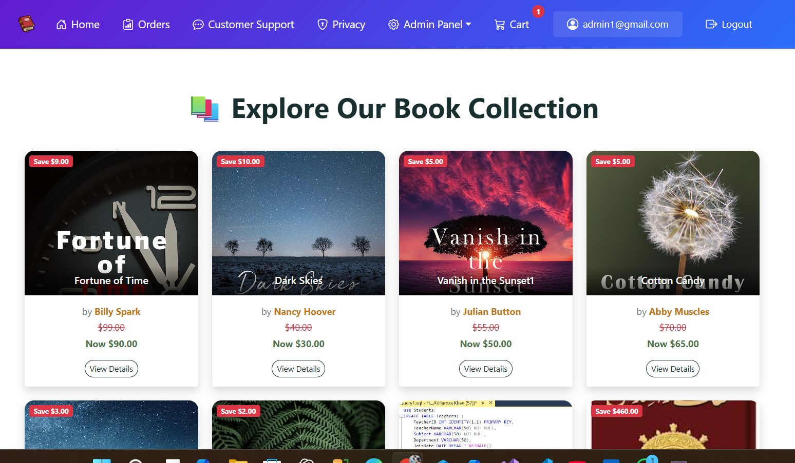  
This is the homepage of the bookstore website, showcasing the layout and initial product listings.

### Cart Page
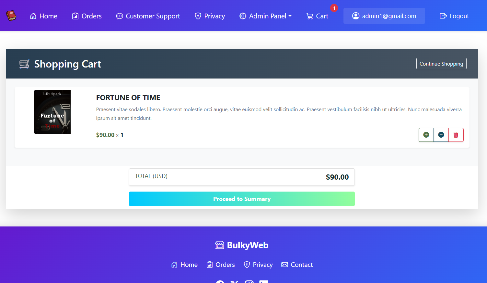  
This is the cart page where users can view and manage the products they’ve added to their cart.

### Order Page
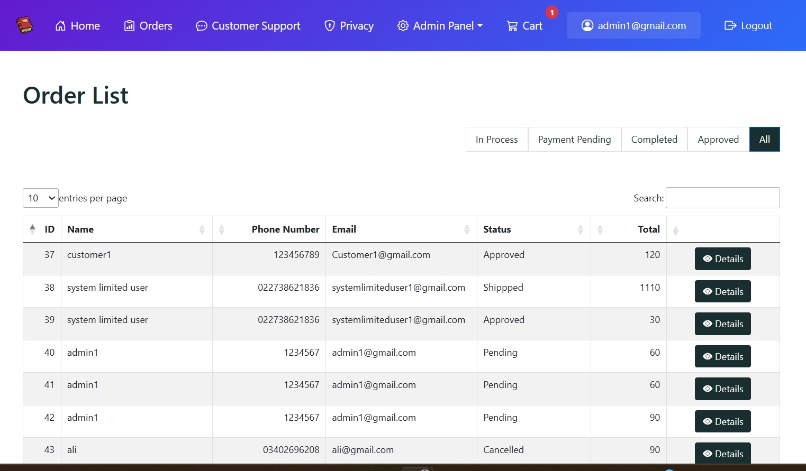  
This is the order page where users can review their orders and checkout.

### AI Chatbot
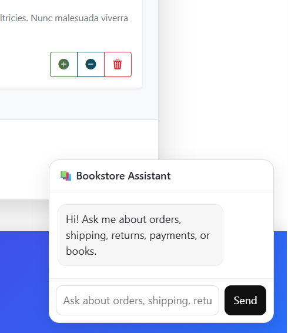  
The AI chatbot that assists users with their queries and recommendations on the site.

### Admin Panel
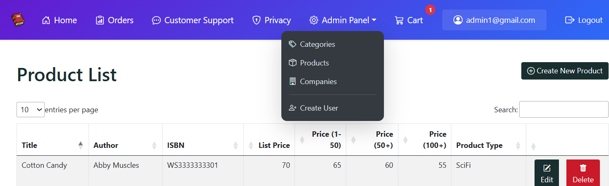  
This is the admin panel where the website’s admin can manage products, users, and orders.

### Admin Portal
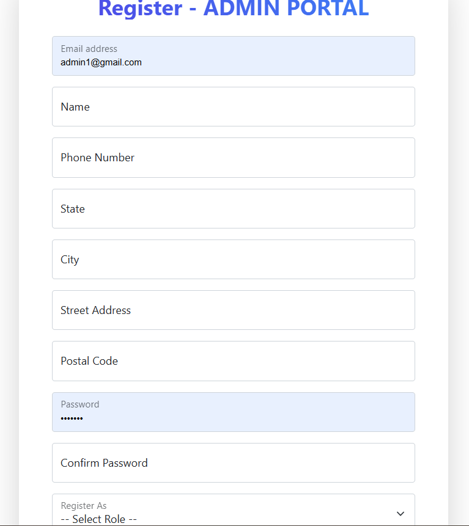  
The admin portal where all backend management tasks are handled, including user and product management.

### Product
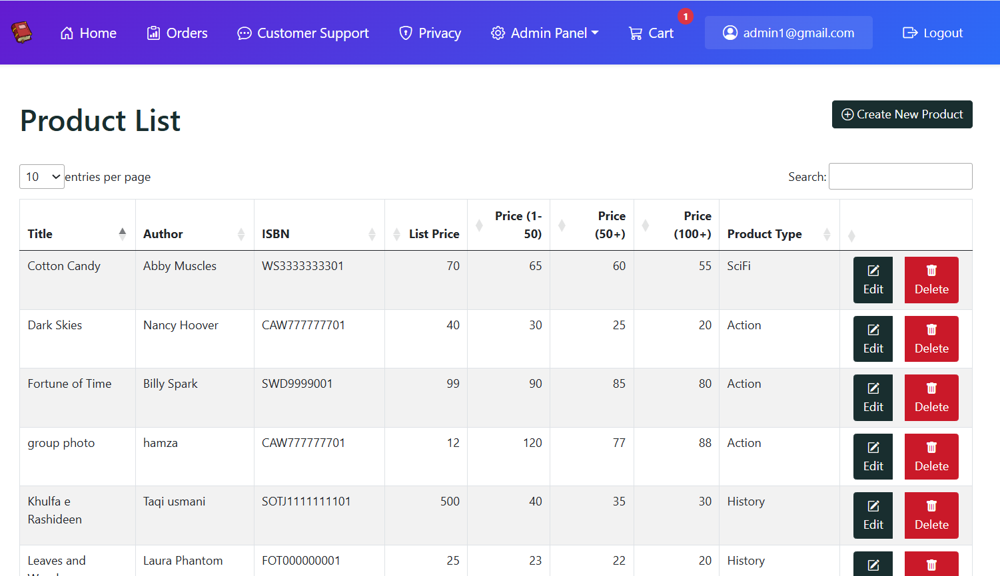  
This shows a detailed view of a specific product page, including descriptions, pricing, and availability.

### Shipping Details
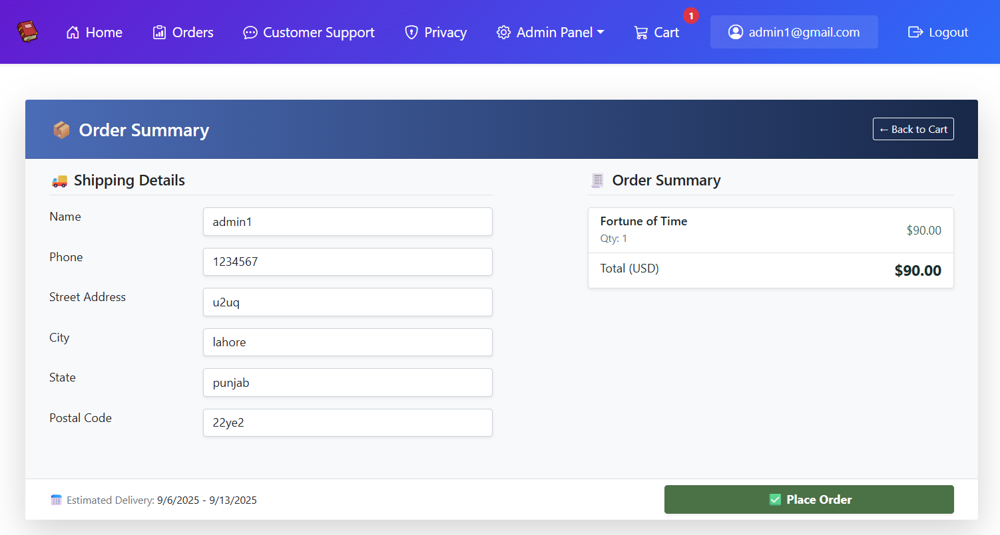  
This page allows users to enter their shipping information to complete the checkout process.

### Book Category
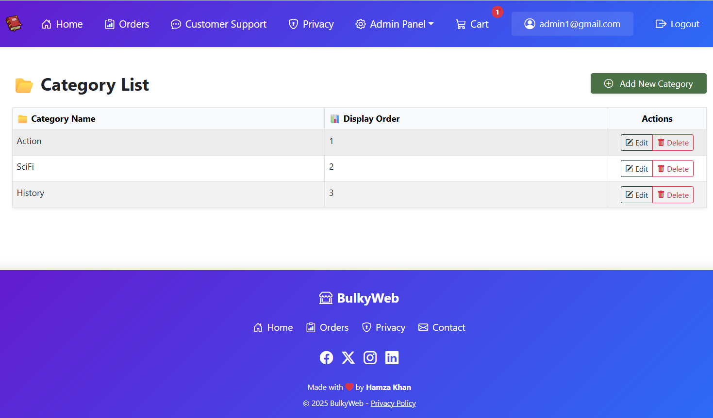  
Here, users can browse books by category.

### Company
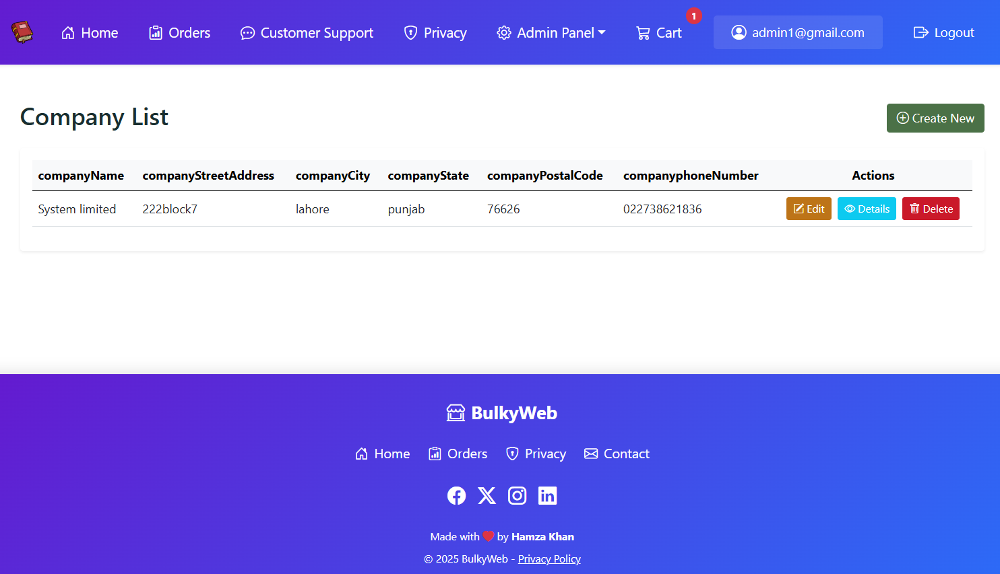  
This is the company information page, providing details about the bookstore.

### Payment Integration
  
This page shows the integration of payment methods, allowing users to complete their purchase.

### PayPal
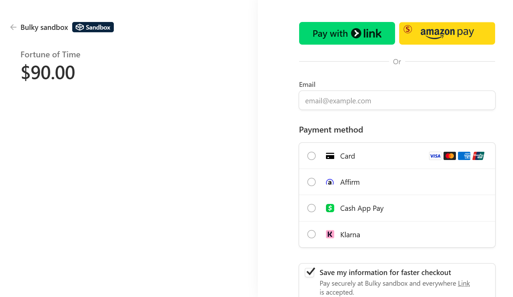  
The PayPal payment gateway for users to securely complete their transactions.


---

## 📌 Getting Started  

1. Clone the repository  
   ```bash
   git clone https://github.com/hamzakhan593/Bulky_MVC
   cd Bulky_MVC
